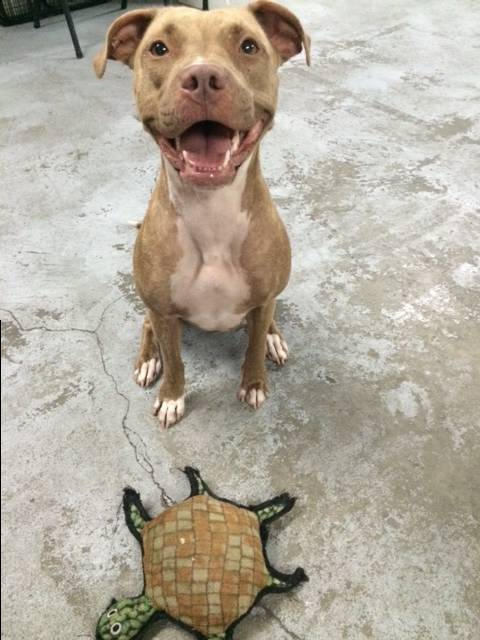

# Web Foundations
## Week 2: HTML

### _Instructor miss cs_

---

### Recap
# What are the 3 foundations of the web?

* HTML <!-- .element: class="fragment" data-fragment-index="1" -->
* CSS <!-- .element: class="fragment" data-fragment-index="2" -->
* JS <!-- .element: class="fragment" data-fragment-index="3" -->

Note: Record people that answer

---

# What is HTML?

HTML is the code that allows us to build websites

---

# The HTML Story

* Invented by Tim Berners-Lee
* Created "hypertext" to share scientific papers
* First web page August 6, 1991
* Standardized by w3C(onsortium)

---

# HTML5

```
<!DOCTYPE html>
```

Note: What does the doctype do?

---

# HTML Tags

* give meaning to content
* every piece of text you on the page needs to be wrapped in tags
* includes images, videos, audio

---

# Anatomy of a Tag

---


Note: There are lots of smarts under hood. Ask if curiour

---

# Anatomy of HTML Document

```
<doctype HTML>
<html>


</html>
```

What are the two tags that nest directly within the `<html>`?


Note: Have students update their pieces. What goes inside html document? Use YouTube as an example

---

# `cmd + i`
## Top Detectives use the inspector

Note: Open up inspector on their favorite site

---

# Head

Meta information about the page commonly used by search engines

* Title
* Description
* Links to CSS files


Note: What's the head for? What are some things the head contains?

---

# Body

Actual content of the page. Everything that you see.


---

# Headings

Used to style headlines.

```html
<h1>Top Level Heading</h1>
<h2>Secondary Heading</h2>
<h3>Third level</h3>
<h4>Fourth level</h4>
<h5>If you need this level</h5>
<h6>Lowest level heading</h6>
```

Think about outlines in your papers.

---

## Examples of Heading Sizes

------

<h1>Top Level Heading</h1>
<h2>Secondary Heading</h2>
<h3>Third level</h3>
<h4>Fourth level</h4>
<h5>If you need this level</h5>
<h6>Lowest level heading</h6>

---

# Paragraphs

Used for grouping sentences together.

```html
<p>This is a simple and short sentence.</p>

<p>
  Paragraphs can be composed of simple and short sentences.
  Sentences combines to form phrases.
</p>
```

Think about writing or reading a book.


Note: logical grouping. like writing

---

# Lists

Used for marking up sequential content.

```html
<ul>
  <li>Apple</li>
  <li>Pear</li>
  <li>Kiwi</li>
</ul>
```

---

## Unordered Lists

When the order doesn't matter. Default uses bullets

```html
<ul>
  <li>Apple</li>
  <li>Pear</li>
  <li>Kiwi</li>
</ul>
```

<ul>
  <li>Apple</li>
  <li>Pear</li>
  <li>Kiwi</li>
</ul>


---

## Ordered Lists

When order matters.

```html
<ol>
  <li>Apple</li>
  <li>Pear</li>
  <li>Kiwi</li>
</ol>
```

<ol>
  <li>Apple</li>
  <li>Pear</li>
  <li>Kiwi</li>
</ol>


---

# Links

To connect to other pages and sites

```
<a href="http://www.website.com">Great Website</a>
```

---

# HTML Attributes

Accessories for your HTML. Give it more power.

```
href=""
```

---

# Link Attributes

Tell the link to do different actions

---

### Email

```html
<a href="mailto:sponsorships@girldevelopit.com">
  E-mail us!
</a>
```

<small>Don't put your email directly on your page to avoid bots!</small>

-----

### Target

Open links in new pages or tabs

```
<a href="http://www.site.com" target="_blank">Link Text</a>
```

---

# Folder Organization


Note: Have them setup their folders

---



<small>Mitra sitting with her favorite turtle toy</small>

---

# Image Internals

```


```

---

# What attributes do you see on the image tag?

---

# `src=""`

* Tells us where to find the image
* Different types of extensions

Note: What type of extensions do you see

---

# `alt=""`

* Used by screen readers
* Displayed if your image doesn't load. Good!

---

## Absolute Path

```html
<a href="http://www.site.com" target="_blank">
  Link Text
</a>
```

## Relative Path

```html

```

---

# How can we make images links?

```html
<a
  href="http://instagram.com/mitrapibil" target="_blank">
  
</a>
```

We nest tags!

---

# Nesting is

Putting tags inside tags to make compound elements.


---

# Quotes

For marking up quotations and citations

<blockquote>
  <p>This is a quote by someone</p>
  <p>It can have multiple paragraphs</p>
  <cite>By A Person</cite>
</blockquote>

---

# Long Quotes

```
<blockquote>
  <p>This is a quote by someone</p>
  <p>It can have multiple paragraphs</p>
  <cite>By A Person</cite>
</blockquote>
```

---

# Short Quotes

```
<p>
  This is a <q>Quote in the middle of a paragraph</q>
</p>
```

---

# Emphasis

HTML tags represent speech

---

# To mark important text (sometimes in bold)

```
<ul>
  <li>
    <strong>Name:</strong> Claudina Sarahe
   </li>
   <li>
     <strong>Favorite Color:</strong> Purple
   </li>
</ul>
```

---

# Video

```
<video></video>

```

Note: Show how to read docs all the cool things you can use!

---

# Audio

```
<audio></audio>
```

---

# Character Codes


---

# Emoji

Emoji is just character codes

---

# Go further on your own

* https://www.khanacademy.org/computing/computer-programming/html-css
* https://www.codecademy.com/learn/web
* https://www.codecademy.com/learn/make-a-website

Note: 2. new release summer 3. more advanced but you are all capable

---

# Colophon

This talk drew inspiration from the following resources. Super big thanks to those that share freely.

* [Girl Develop It HTML/CSS Intro Class 1](https://girldevelopit.github.io/gdi-featured-html-css-intro/class1)  
* [MDN HTML Basics](https://developer.mozilla.org/en-US/docs/Learn/Getting_started_with_the_web/HTML_basics)

### You are free to remix this lesson plan
